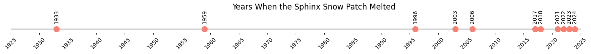
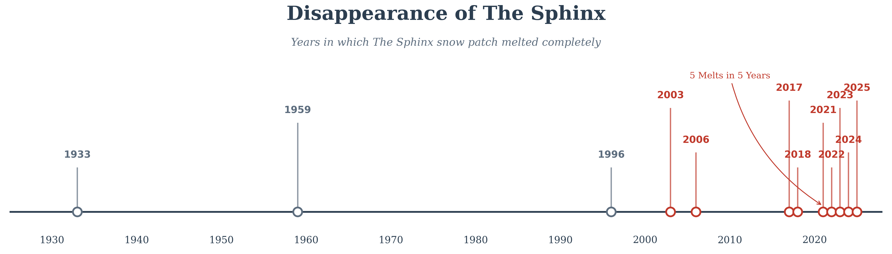

  <strong style="font-size: 2rem;">Blogs</strong>

::: {.text-center}
This page is a repository for my blog posts.  
Blogging provides an informal platform through which to share my research.  
Expect mountains, snow, satellites, and maybe a few personal opinions on academia, climate change, and life.  
**All views are my own.**
:::

---

## **1 - Chasing snow patches in the Cairngorms**
**September 2024**

It might come as a surprise, but even in the mild climate of Scotland, snow manages to endure year-round in certain sheltered mountain locations. In fact, until recently, some highland corries would house perennial snow patches for many decades without seeing them melt. The fine balance between preferential snow deposition in winter and sheltering in summer makes predicting the distribution of these snow patches a rigorous test for the kind of physically based snow models used in climate projection and impacts studies. This is the basis of my PhD research.

This summer, my fieldwork took me to Coire Cas on Cairngorm Mountain, where I aimed to map the areal extent and measure the reflective properties of some persistent snow patches. My tool for the job was a DJI M210 drone equipped with a multispectral sensor matched to the [Sentinel-2](https://sentiwiki.copernicus.eu/web/s2-mission) satellite sensor. 

Conducting multispectral drone surveys requires two things notoriously scarce in the Scottish Highlands: low winds and clear skies. Moreover, this summer was dubbed [‘Scotland’s worst since 2015’](https://www.heraldscotland.com/news/24558427.scotlands-weather-worst-summer-since-2015--says-met-office/), limiting us to a single day of drone surveys. The scarcity of cloud-free days this season is visualised in Figure 1 below.

::: {.text-center}

:::

Despite the inclement weather, we did manage to retrieve some spectral measurements of the late-lying snow on the 24th June (Figure 2 shows one of the short-lived sunny intervals on the day). These data will help improve the snow mapping algorithms which, in turn, feed into research and contribute to discussions concerning biodiversity, water resources, and risk management in cold and mountainous regions.

::: {.text-center}

:::

In addition to my fieldwork, this summer I made my first ‘pilgrimage’ to a remote North-East facing corrie on Braeriach mountain called Garbh Choire Mòr. This location is considered to be the snowiest place in the UK and houses the famous Sphinx snow patch (see Figure 3). 

The Sphinx has made it to popular news platforms numerous times over the past few years, and this year marks an unprecedented fourth consecutive year of its disappearance. Figure 4 shows a timeline marking the years that the Sphinx has disappeared; the trend seen here mirrors the significant impacts of climate change on Scotland's winter conditions. 

Current projections suggest a stark future with [‘little to no snow by the 2080s’](https://www.climatexchange.org.uk/wp-content/uploads/2023/09/cxc-snow-cover-and-climate-change-in-the-cairngorms-national-park_1.pdf) — a disheartening forecast for chionophiles like myself.

::: {.text-center}

:::

<!-- {.column-page} -->
::: {.column-screen-inset .text-center}

:::

___
___

## **2 - The Death of Scotland’s Zombie Glaciers**
**Published in 'The Geographer' magazine, Spring 2026**

### Introduction: The language of snow

In the mountainous regions of Japan, farmers have historically looked to the high peaks in spring for Yukigata (雪形)—"snow shapes." Each year the melting snow would create repeating patterns —a horse, a butterfly, or an old man— that signal the date to sow your seeds. They are a natural calendar written on the landscape; a dialogue between the mountains and the people living below them.

Closer to home, the Welsh speak of esgyrn eira—"snow bones." It is a hauntingly poetic descriptor for those stubborn, late-lying drifts that linger in the gullies long after the green has returned to the valleys. They are the skeletal remains of winter, hinting at the structure of the season passed.

For centuries, Scotland had its own "snow bones". Folklore and early travelogues spoke of the "eternal snows" of Braeriach and Ben Nevis. To the casual hillwalker, they were just patches of white. But to the geographer, they were a cryospheric link to the Little Ice Age (approx. 1650–1850 AD). Today, however, that link is broken. We are witnessing a regime shift in the Scottish uplands, where the perennial ice of the last three centuries is giving way to the transient, ephemeral snow of the future.

### The Past: Ghosts of the Little Ice Age 

For decades, the prevailing scientific consensus, championed by the late ecologist, Dr. Adam Watson, was that Scotland had been glacier-free for 11,000 years and that the “snow bones” were exactly that, lingering static remnants of the past. However, this view was challenged by a study published in 2013 in The Holocene. Martin Kirkbride and colleagues utilised cosmogenic 10Be dating to re-examine boulder ridges in the Cairngorms. The findings provided evidence that small, slab-like glaciers likely regenerated in high corries during the Little Ice Age.

This recontextualizes our understanding of features like "The Sphinx" on Braeriach (see photo). It suggests that for much of modern history, these were not just snow patches, but "zombie glaciers"—regenerated glacierets surviving on a lifeline of wind-blown accumulation. They were the last holdouts of a colder era, protected by the steep, north-facing headwalls of the Cairngorm plateau.

::: {.text-center}

:::

### The Present: The Fracture (2021–2024) 

If the 18th century was the era of the glacieret, the 2020s are the era of their extinction. The most alarming signal is not just that the snow is melting, but the frequency with which it is disappearing.

Historical records indicate that the Sphinx melted completely only three times in the entire 20th century: 1933, 1959, and 1996. It was a rare, generational event. However, annual surveys published in Weather by Adam Watson, Iain Cameron and colleagues reveal a collapse in this durability. The timeline of the last 100 years of the Sphinx is outlined below and evidence supports that before 1933 snow had not melted here since the Little Ice Age. Now, The Sphinx has melted completely for five consecutive years: 2021, 2022, 2023, 2024, and 2025.

::: {.column-screen-inset .text-center}

:::

Could this represent a fundamental “regime shift” where summer ablation will systematically outpace winter accumulation and our bones will no longer last the year? I think not: inter-annual variability is too large. But I think it’s fair to say that the “eternal snows” are certainly a thing of the past.

### The Future: The Empty Corries 

If the Yukigata were the traditional predictors of the seasons, our modern equivalents are climate models—and their forecast is stark. We are looking at a future of corries empty of snow.

Climate projections using UKCP18 data suggest that, under high-emissions scenarios (RCP 8.5), snow cover duration in the Cairngorms will decline rapidly after 2050, potentially leading to years of “little to no snow” by the end of the century. This is not merely a shift in weather; it is a fundamental alteration of the Scottish landscape’s character. We are moving toward a "snow-free" future where the esgyrn eira do not just break—they fail to form altogether.

### The Cost: From Ecology to Economy 

The extinction of these features triggers a cascade across the landscape. Ecologically, we risk desynchronizing the food web: Dotterel rely on insect pulses from melting snowbeds, while Ptarmigan are left exposed when their white winter plumage meets a brown, snow-free hillside. Hydrologically, we lose a critical "cold reservoir" that buffers stream temperatures for Atlantic salmon during hot summers.

The human cost is equally significant. Towns like Aviemore, built on the 1960s "ski dream," face an economic pivot as the reliable winter vanishes. For those of us who climb and walk these hills, the change is noticeable. The consistent winter conditions that once defined the season are becoming harder to find, and the landscape we travel through is undeniably changing. We are watching a distinct chapter of Scottish mountaineering slowly fade.

### Conclusion 

In Japan, the Yukigata were trusted because they were consistent. In Scotland, our "snow bones" are becoming brittle. The disappearance of the Sphinx is not just the loss of a patch of white on a map; it is the final closing of the door on the Little Ice Age and the beginning of a new, warmer, and ecologically poorer chapter for Scotland's mountains.

As we mark the International Year of Glaciers' Preservation, our task is not just to mourn the ice we are losing, but to document it. We are the last generation who will see the bones of winter last the summer. 

________________________
**Citizen Science: Tracking the Vanishing Ice** The study of Scotland’s snow patches relies heavily on citizen science. The "regime shift" we are witnessing has been reliably documented by authors like Iain Cameron and the contributors to the annual Weather reports.

**Want to get involved?** If you are a hillwalker or climber, your observations are valuable data.

* Join the Community: Visit the **"Snow Patches in Scotland"** Facebook group to see current reports and photos.
* Submit Your Data: Have you spotted a late-lying patch? Consider posting on the facebook group or email me at [leamhowe1@gmail.com](mailto:leamhowe1@gmail.com). Time, date, and approximate size (length, width, or area with a GPS?) are really useful metrics for our research. Also knowing the last day of meltout is important, so if you fancy hunting down some snow patches as they melt away next summer please let us know.

### References & Further Reading
* **Cameron, I., Fyffe, B. and Kish, A. (2024).** No Scottish snow patches survive until winter 2023/2024. Weather.
* **Harrison, S., et al. (2014).** Little Ice Age glaciers in Britain: Glacier–climate modelling in the Cairngorm Mountains. The Holocene.
* **Kirkbride, M., et al. (2013).** Late-Holocene and Younger Dryas glaciers in the northern Cairngorm Mountains, Scotland. The Holocene.
* **Spracklen, B.D. and Spracklen, D.V. (2023).** Decline of Late Spring and Summer Snow Cover in the Scottish Highlands. Remote Sensing.
* **Rivington et al., 2019.** Snow Cover and Climate Change in the Cairngorms National Park: Summary Assessment.
* **Watts, S.H., et al. (2022).** Riding the elevator to extinction: Disjunct arctic-alpine plants of open habitats decline. Biological Conservation.
For those interested in contributing to snow patch monitoring, follow the annual surveys published in Weather by the Royal Meteorological Society.

_______________