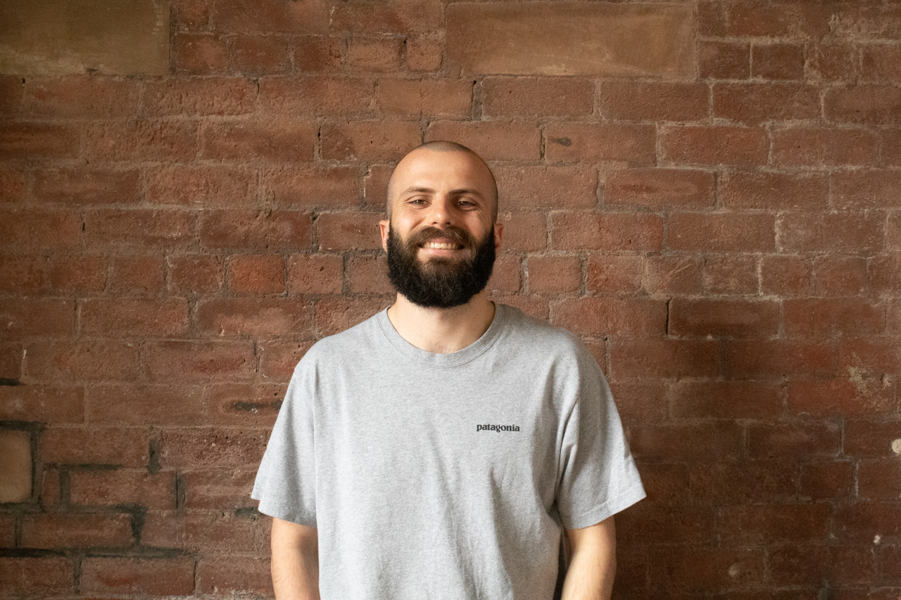

  
  <!--  -->

  <strong style="font-size: 2rem;">Leam Howe</strong>

  
PhD Student, SENSE CDT School of GeoSciences, University of Edinburgh

  
<a href="mailto:leam.howe@ed.ac.uk">leam.howe@ed.ac.uk</a>

  <!-- 
<a href="https://www.linkedin.com/in/leamhowe">LinkedIn</a>
 -->

:::{.text-center}
{width=80%}
:::

---

### About

<!-- PhD researcher in environmental data science, specializing in the remote sensing and modelling of mountain snow. My work spans the full observational scale: from in-situ fieldwork and UAV surveys to aerial and satellite Earth Observation.

Keen on encouraging more interdiciplinary collaborations, I co-founded the [Machine Learning for Geoscience and Earth Observation (Ml4GEO)](https://ml4geo-ed.github.io/) group. I'm also passionate about outreach and effective communication of science, in recent years I've spent a lot of time working on and chairing the [SatSchool Outreach](satschool-outreach.github.io/) project.

Partial to mountains, snow, and coffee. 🏔️❄️☕ -->

Hi, I'm Leam! 👋 Currently I am a PhD researcher at the University of Edinburgh, funded through the [SENSE Earth Observation CDT](https://eo-cdt.org/). I research mountain snow, with a focus on Scotland as a particularly challenging test bed for remote sensing and modelling of efforts. You can read more about my PhD research [**here**](phd-project.qmd). 

<!-- and background in my [CV](cv/cv.qmd). -->

My interest in remote sensing to inform environmental science drove my decision to pursue a PhD with SENSE. My work has spanned the full observational scale -- from in-situ fieldwork and UAV surveys to aerial and satellite Earth Observation. I have a particular interest in the application of machine learning to combine and take full advantage of large EO and climate datasets. More broadly, I love building interdisciplinary collaborations, with [ML4GEO](https://ml4geo-ed.github.io/) being a prime example. 

I am also passionate about outreach and accessible science communication. I have spent the last few years working on and chairing the [SatSchool Outreach](satschool-outreach.github.io/) project, and I was grateful to receive the **SENSE Outreach Award 2026** in recognition of these efforts.

Outside of the office, you'll usually find me in the hills. I’m a **qualified Mountain Leader** (and working towards my Winter Mountain Leader award), and I love safely sharing my passion for the Scottish mountains with others. If I'm not on a peak, I'm probably relaxing with some good music and a cup of coffee. 🏔️🎶☕

---

### Research Interests

- The Cryosphere  
- Snow  
- Orographic Processes  
- Mountain Meteorology
- Climate Change  
- Earth Observation  
- Remote Sensing  
- AI & Machine Learning  
- Modelling

---

### Previous Studies

- **MSci (Hons) Physics**, University of Nottingham  
- **MRes Climate and Atmospheric Science**, University of Leeds

---

### Affiliations

- PhD funded through the [SENSE Earth Observation CDT](https://eo-cdt.org)  
- CASE partner: [ENVEO IT GmbH](https://www.enveo.at)

---
<!-- ::: {.text-center}
### Flappy Satellite
::: -->

  <!-- <iframe src="pong_game/index.html" width="820" height="520" style="border:none; overflow:hidden;"></iframe> -->
  <!-- <iframe src="dino_game/index.html" width="820" height="520" style="border:none; overflow:hidden;"></iframe> -->
  <iframe src="sat_game/index.html" width="820" height="520" style="border:none; overflow:hidden;"></iframe>
  

